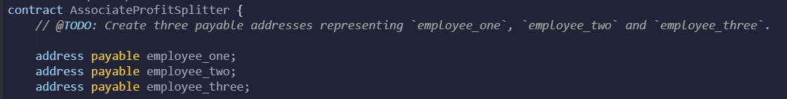
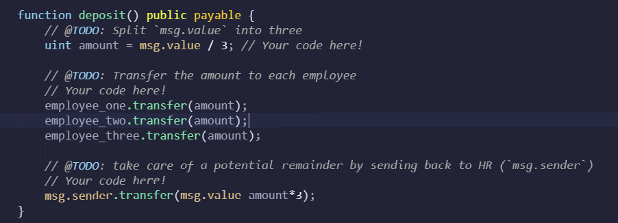
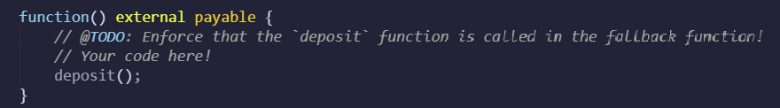
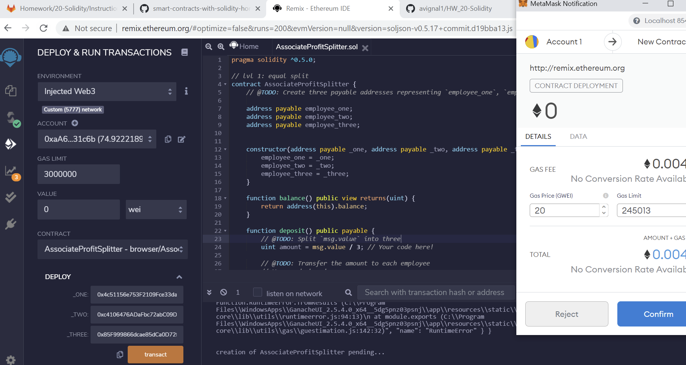
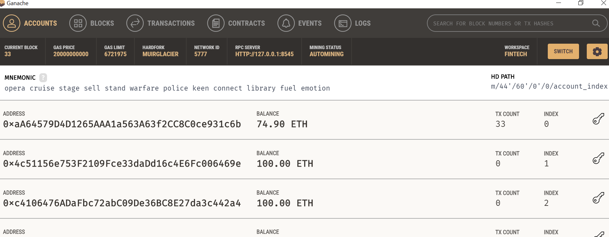
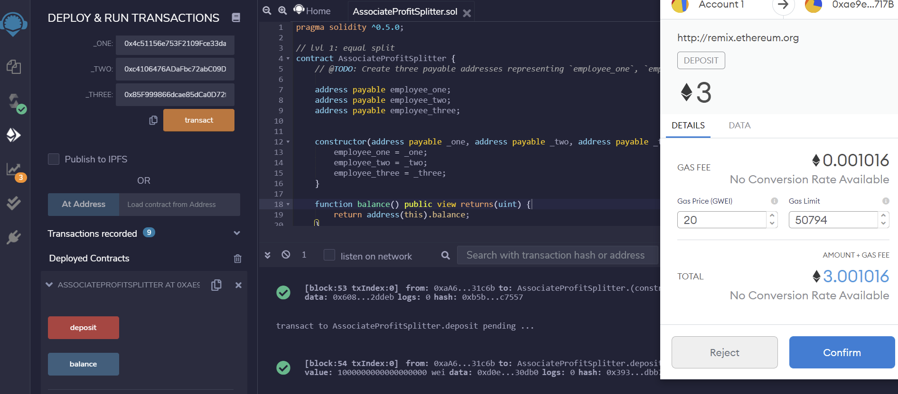
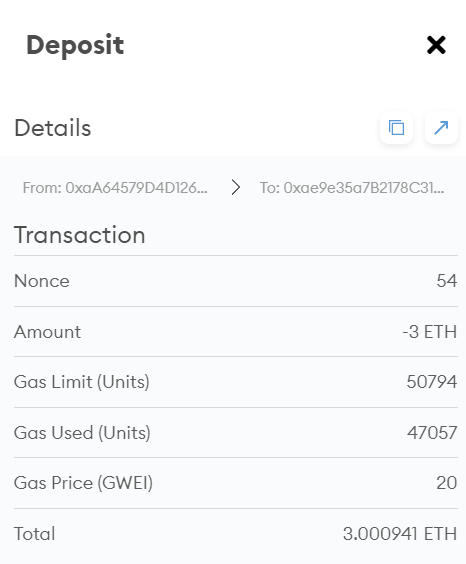
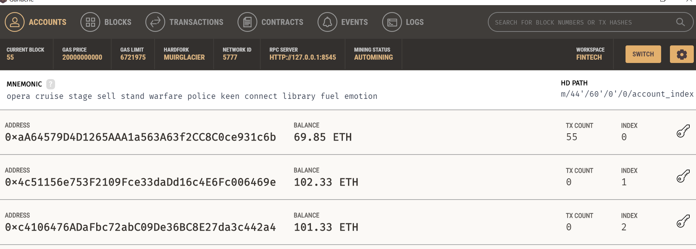

# Associate Profit Splitter

## Smart Contract
- Goal is to deploy a contract that will accept ether and divide evenly among associate level employees

Step 1) Defining Public Variables

Step 2) Creating Constructor that Accepts Payable Addresses

Step 3) Balance Function
    - already defined by StarterCode

Step 4) Deposit Function

    - Uses Global Variables "msg.sender" and "msg.value"

Step 5) External Payable Function

## Deploying Contract
    1. Enviornment set to "Injected Web3" to connect to LocalHost to wallet
    2. Initial value set to 0 wei
    3. Addresses taken from Ganache

## Test Transaction

    - Account information for the sending account and 3 recipient accounts

    1. After deploying contract, set up transaction parameters 

    2. Confirm transaction

    3. Updated Account Figures in Ganache

